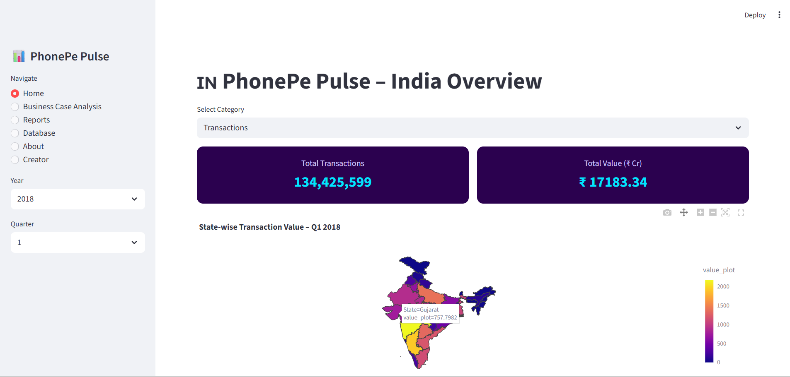
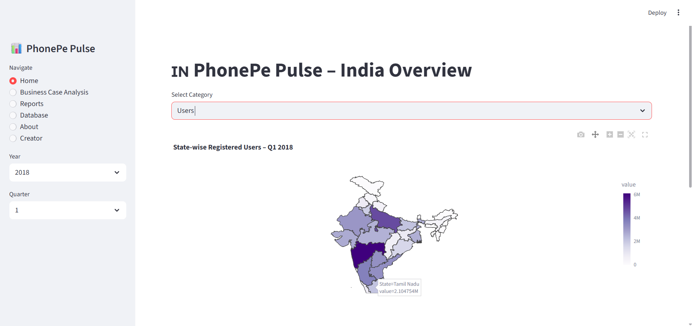
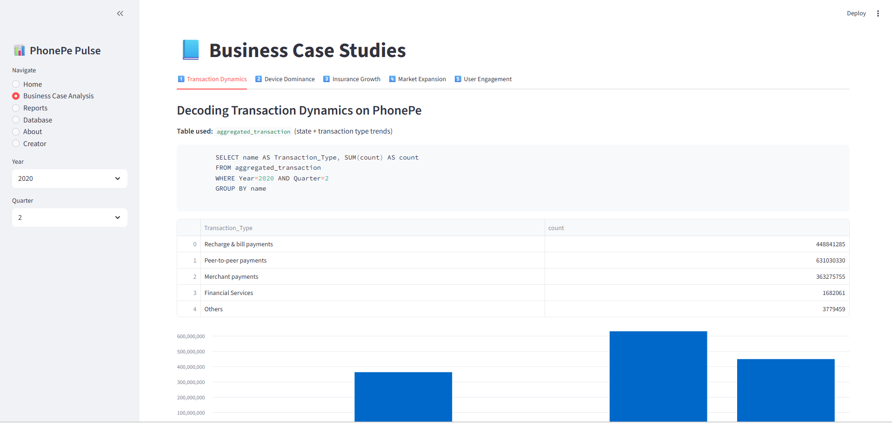
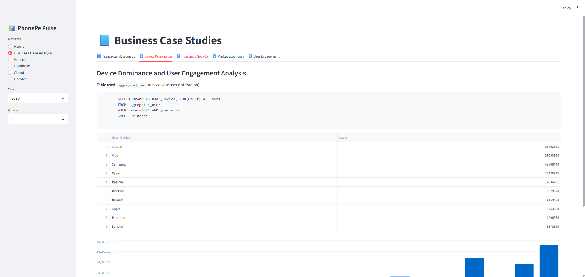
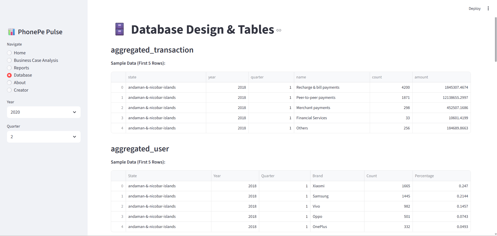
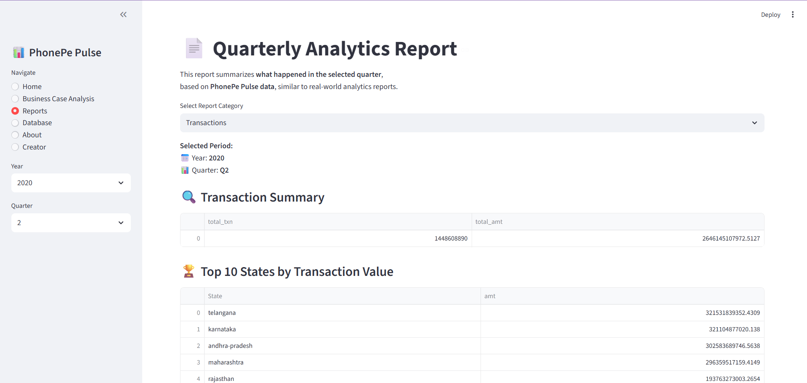
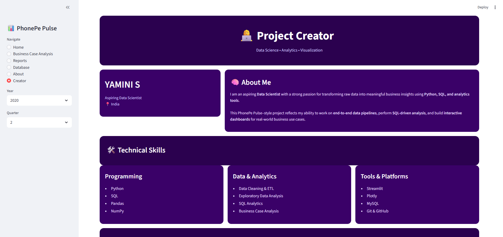
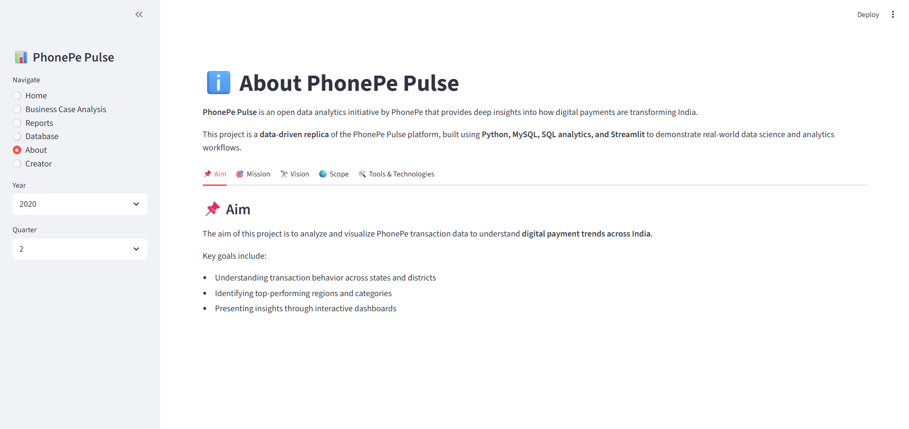

# 📊 **PhonePe Pulse – End-to-End Data Analytics Dashboard**
A full-stack data analytics project replicating the official PhonePe Pulse platform using **Python, MySQL, SQL analytics, and Streamlit**.
This project transforms raw digital payment data into **interactive insights, business case studies, and professional reports**.

---

## 🔍 **Project Overview**

PhonePe Pulse is an open data initiative that showcases how digital payments are shaping India’s economy.

This project is a **data-driven analytical replica** that demonstrates:

* **Large-scale data ingestion & transformation**
* **SQL-driven business analysis**
* **Interactive dashboards with maps & charts**
* **Professional reporting for decision-making**

📅 **Data Coverage:** 2018 – 2023
📊 **Granularity:** Quarterly | State | District

---

## 🧠 **Key Objectives**

* **Analyze transaction growth patterns across India**
* **Study user adoption & device dominance**
* **Understand insurance penetration trends**
* **Enable business-driven insights using SQL**
* **Present results through interactive dashboards & reports**

---

## 🛠️ **Tech Stack**

### 🔹 Programming & Analytics

* **Python**
* **Pandas, NumPy**
* **SQL (Advanced Aggregations)**

### 🔹 Database

* **MySQL (9 normalized analytical tables)**

### 🔹 Visualization

* **Streamlit**
* **Plotly (Choropleth Maps & Charts)**

### 🔹 Tools

* **Git & GitHub**
* **VS Code**

---

## 🗂️ **Database Design (9 Tables)**

* **aggregated_transaction**
* **aggregated_user**
* **aggregated_insurance**
* **map_transaction**
* **map_user**
* **map_insurance**
* **top_transaction**
* **top_user**
* **top_insurance**

Each table is **validated and previewed directly inside the application**.

---

## 📸 **Application Screenshots & Explanation**

All screenshots are stored inside the **screenshots/** folder of this repository.

---

### 🗺️ **State-wise Transactions Map**



**What it shows:**

* India choropleth map
* State-wise transaction value
* Hover-based insights (₹ Cr)

---

### 👥 **Users – State-wise Map**



**What it shows:**

* Registered users by state
* Highlights adoption intensity
* Supports user growth analysis

---

### 🛡️ **Insurance – State-wise Map**


**What it shows:**

* Insurance transaction value (₹ Lakh)
* Reveals low vs high penetration regions

---

### 📘 **Business Case Analysis – Transactions**



**What it shows:**

* SQL-driven insights
* Transaction type trends
* Direct business interpretation

---

### 📱 **Device-wise User Distribution**



**What it shows:**

* Android vs iOS vs Others
* Device dominance trends
* Helps in platform optimization decisions

---

### 🗄️ **Database Tables Page**



**What it shows:**

* All 9 tables explained
* Live preview of first 5 rows
* Demonstrates data integrity

---

### 📄 **Reports Generation Dashboard**



**What it shows:**

* Quarter-wise report selection
* Auto-generated executive summaries
* PDF download functionality

---

### 👩‍💻 **Creator Page**



**What it shows:**

* Developer profile
* Skills & tools
* Professional presentation

---

### ℹ️ **About Page**



**What it shows:**

* Aim, mission, vision, scope
* Tools & technologies used

---

## 📄 **Reports & Deliverables**

* 📊 **Interactive Streamlit Dashboard**
* 🧾 **Auto-generated PDF Analytics Reports**
* 📈 **SQL-driven Business Case Studies**
* 📊 **Presentation Slides (PPT)**

---

## 🚀 **How to Run the Project (Local)**

```bash
# Clone repository
git clone <your-repo-url>

# Create virtual environment
python -m venv venv
venv\Scripts\activate

# Install dependencies
pip install -r requirements.txt

# Run Streamlit app
streamlit run app.py
```

---

🔐 **Database credentials are secured using environment variables.**

---

## 💼 **Why This Project Matters**

* **Demonstrates end-to-end data analytics**
* **Strong SQL + Python integration**
* **Real-world business storytelling**
* **Interactive dashboards (not static charts)**
* **Clean, scalable, production-style design**

---

## 👤 Author

**Yamini S**              | Aspiring Data Scientist  
📍 India                 | 📧 syamini1428@gmail.com  
**🔗 LinkedIn**              | https://www.linkedin.com/in/yamini-s-886572371/


---

✨ **Thank you for reviewing this project!**
